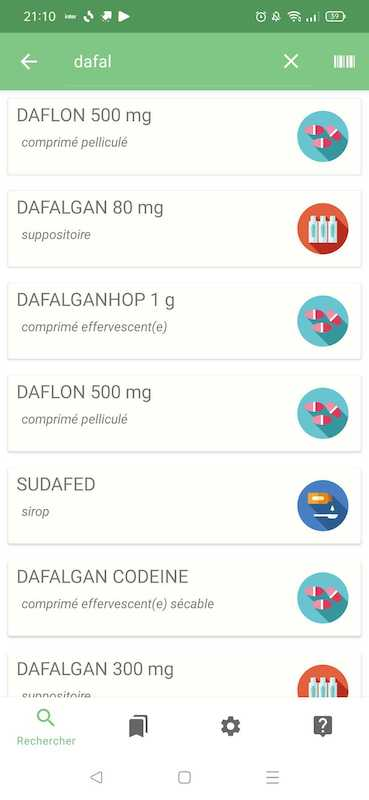

## L\'application

Permet de consulter les informations d'un médicament en cherchant son nom ou en scannant le produit.

## Screen

## Libraries

Kotlin, RxJava 2, Room, LiveData, Fragment, Navigation, Constraint Layout, Viewpager

## Data

[BASE DE DONNÉES PUBLIQUE DES MÉDICAMENTS](https://base-donnees-publique.medicaments.gouv.fr/telechargement.php)

## License

Copyright 2022 Yoann Le Taillanter

Licensed under the Apache License, Version 2.0 (the "License"); you may not use this file except in compliance with the License. You may obtain a copy of the License at http://www.apache.org/licenses/LICENSE-2.0
Unless required by applicable law or agreed to in writing, software distributed under the License is distributed on an "AS IS" BASIS, WITHOUT WARRANTIES OR CONDITIONS OF ANY KIND, either express or implied. See the License for the specific language governing permissions and limitations under the License.